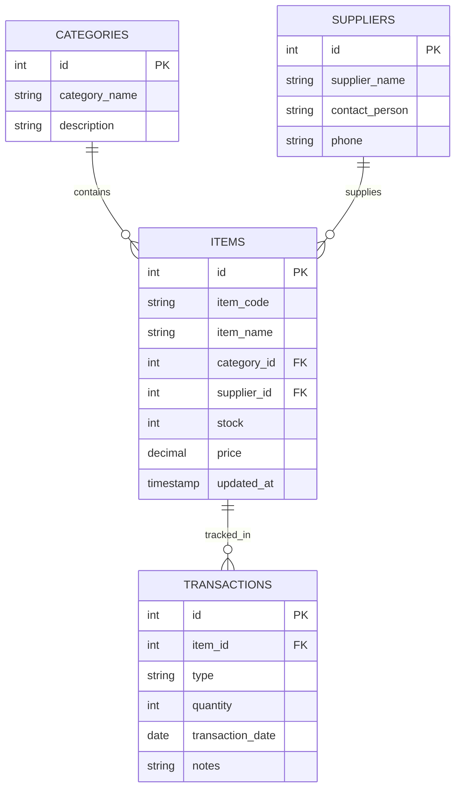
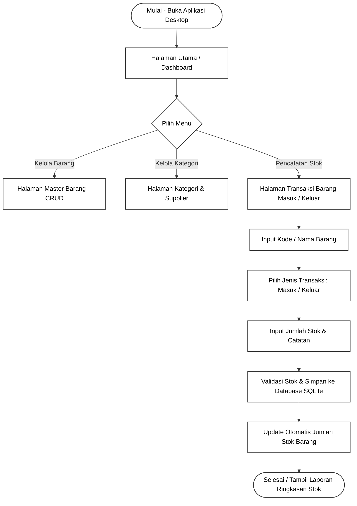

**APLIKASI MANAJEMEN INVENTARIS TEFA — SELEKSI TEFA RPL SMKN 1 KATAPANG**

Sistem informasi berbasis Desktop untuk pengelolaan inventaris barang, pencatatan stok, manajemen kategori dan supplier, serta pemantauan arus masuk dan keluar barang secara efisien dan real-time.

**Fitur Utama**

* **Sistem CRUD Inventaris Lengkap:** Pengolahan data barang (Tambah, Edit, Hapus, Lihat), kategori, dan supplier.
* **Manajemen Stok Transaksional:** Pencatatan riwayat barang masuk dan barang keluar secara otomatis.
* **Pencarian & Filtering Interaktif:** Pencarian barang secara instan berdasarkan nama, kode barang, atau kategori pada DataGrid.
* **Dashboard Ringkasan & Laporan:** Ringkasan statistik total barang, barang kritis/hampir habis, serta ekspor laporan ringkas.

**Tech Stack**

* **Framework:** .NET / C# WPF (Windows Presentation Foundation)
* **Architecture Pattern:** MVVM (Model-View-ViewModel)
* **Database:** SQLite (Embedded Local Database)
* **UI Styling & Icons:** MaterialDesignInXaml / Custom XAML Resources

**Time Schedule (Linimasa Pengerjaan)**

Berikut adalah estimasi tahapan pengerjaan proyek berdasarkan siklus pengembangan perangkat lunak (SDLC):

| No | Fase SDLC | Aktivitas Utama | Estimasi Waktu |
| :--- | :--- | :--- | :--- |
| 1 | **Analisis & Kebutuhan** | Menganalisis studi kasus inventaris, menentukan entitas barang, dan batasan sistem desktop. | Hari ke-1 |
| 2 | **Perencanaan (Planning)** | Menyusun *Time Schedule*, arsitektur MVVM, serta struktur project C# WPF. | Hari ke-1 |
| 3 | **Perancangan (Design)** | Membuat skema database SQLite, relasi tabel inventaris, dan perancangan UI/UX XAML. | Hari ke-2 |
| 4 | **Development (Coding)** | Implementasi Model, ViewModel, View (XAML), serta integrasi SQLite menggunakan ORM / Entity Framework. | Hari ke-2 s.d. Hari ke-3 |
| 5 | **Testing & Debugging** | Pengujian fungsionalitas CRUD, pencarian, kueri database lokal, dan perbaikan *bug*. | Hari ke-4 |
| 6 | **Build & Deployment** | Finalisasi project, kompilasi ke format `.exe`, serta *push* repository ke GitHub. | Hari ke-4 |

**ERD & Rancangan Struktur Database**

Sistem ini menggunakan database lokal **SQLite** dengan struktur relasi antar tabel sebagai berikut:

**Flowchart Sistem Manajemen Inventaris**

**Arsitektur Folder & Pola MVVM**

Aplikasi ini dibangun menggunakan arsitektur **MVVM (Model-View-ViewModel)** untuk memisahkan logika bisnis, pemrosesan data, dan tampilan antarmuka (UI):

* **Models (`Models/`)**
  * `Item.cs` — Merepresentasikan struktur data barang/inventaris.
  * `Category.cs` — Memuat data kategori barang.
  * `Supplier.cs` — Memuat data supplier barang.
  * `Transaction.cs` — Memuat data riwayat transaksi stok masuk dan keluar.

* **ViewModels (`ViewModels/`)**
  * `MainViewModel.cs` — Mengatur navigasi antar halaman dan status utama aplikasi.
  * `ItemViewModel.cs` — Mengatur proses CRUD barang, pencarian, dan *binding* ke DataGrid.
  * `TransactionViewModel.cs` — Mengatur penambahan transaksi dan pembaruan jumlah stok.

* **Views (`Views/`)**
  * `MainWindow.xaml` — Jendela utama aplikasi dengan navigasi *sidebar*.
  * `ItemView.xaml` — Tampilan form input dan tabel DataGrid daftar barang.
  * `TransactionView.xaml` — Tampilan pencatatan arus stok barang.

**Panduan Menjalankan Aplikasi & Eksekusi Build**

* **Prasyarat Sistem**
  * Sistem Operasi: Windows 10 / 11 (64-bit)
  * .NET SDK / .NET Desktop Runtime
  * IDE: Visual Studio 2022 dengan *workload* .NET Desktop Development

* **Langkah Menjalankan dari Source Code**
  * Clone repositori ini ke komputer:
    `git clone https://github.com/[username-github]/Upload-Project-Desktop-TeFa.git`
  * Buka file solusi `.sln` menggunakan Visual Studio 2022.
  * Lakukan *Restore NuGet Packages* untuk mengunduh *library* yang dibutuhkan seperti SQLite dan MaterialDesign.
  * Tekan tombol **F5** atau klik tombol **Start** untuk menjalankan aplikasi.

* **Cara Mendapatkan File Executable (`.exe`)**
  * File executable siap pakai (`.exe`) beserta pustaka pendukung dapat ditemukan pada folder `build/` atau diunduh melalui menu **Releases** pada repositori GitHub ini.
  * Jalankan file `InventoryDesktop.exe` secara langsung untuk menggunakan aplikasi.
